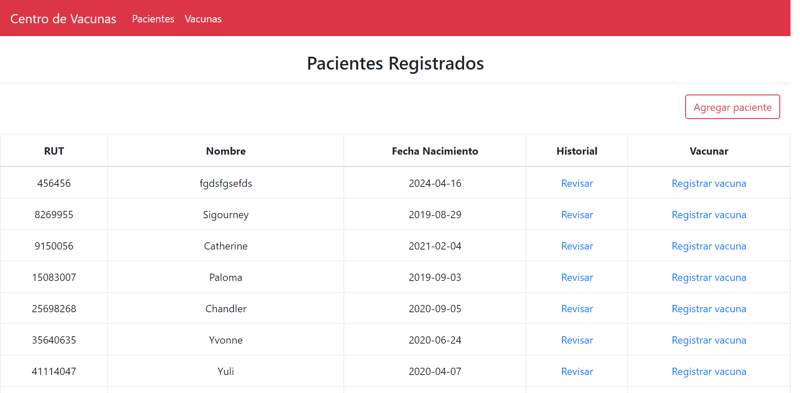

# Screenshot

# Centro de Vacunas

_Aplicación web para llevar registro de pacientes y vacunas manejadas por el centro._

## Descarga

_Para descargar el repositorio podemos hacerlo en la opción de "Clone or Download" o por consola con el comando "git clone https://github.com/Jonathan-act/ProyectoPY.git"._

### Pre-requisitos

- Python3 (PIP instalado, en windwos viene con el paquete, en linux se debe instalar por consola)
- Mysql
- HeidiSql (o algún cliente para mysql)
- Editor de texto

### Dependencias

- pip install flask
- pip install flask-mysql

### Despliegue

- Una vez descargado el repositorio
- Verificaremos los programas y dependencias necesarias
- Crearemos nuestra base de datos con el nombre "centro-vacunas" e insertaremos los datos (sql/tablas.sql, sql/datos.sql)
- Abriremos una consola y ejecutaremos el comando "pip install requirements.txt" 
- Ejecutaremos el archivo "index.py", puede ser por consola con el comando "python index.py" o simplemente le damos doble click
- Copiaremos la ip que nos muestra la consola y la pegaremos en nuestro navegador.

## Construido con

* [Bootstrap](https://getbootstrap.com) - Framework para el front-end
* [Python3](https://www.python.org) - Lenguaje de programacíon
* [Flask](https://flask.palletsprojects.com/en/1.1.x/) - Framework de Python
* [Chocolatey](https://chocolatey.org) - Gestor de Software (para mysql)
* [HeidiSQL](https://www.heidisql.com) - Cliente para SQL (en este caso mysql)

## Autor

 -Jonathan Carrasco Toledo
